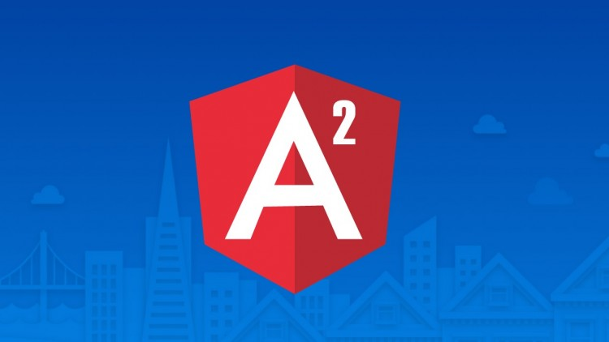
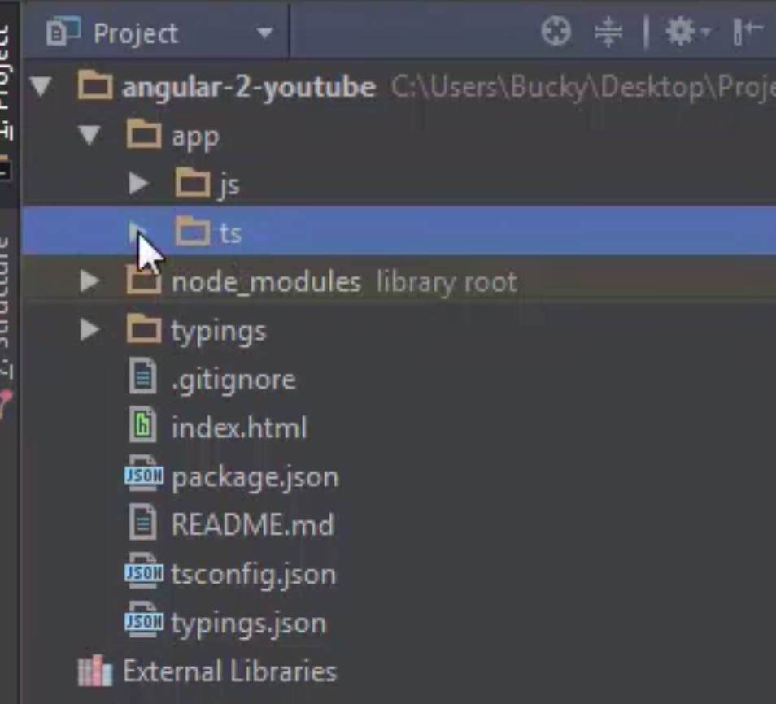
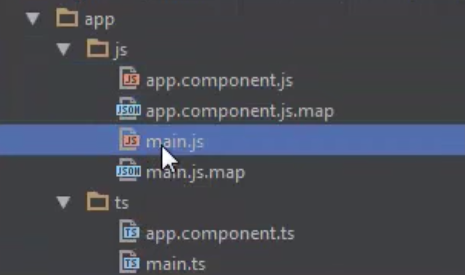

# Anglular 2 

  

Angular 2 is an open source JavaScript framework to build web applications in HTML and JavaScript. This tutorial looks at the various aspects of Angular 2 framework which includes the basics of the framework, the setup of Angular and how to work with the various aspects of the framework. Other topics discussed in the tutorial are advanced chapters such as interfaces, nested components and services within Angular. Topics such as routing, modules, and arrays are also dealt with in this tutorial.

## Resources to clone 

There are a lot of resources required to download even for a base project, I have used bare minimum from BuckyRoberts example which can be found [here](https://github.com/buckyroberts/angular-2-template)

## Installing NPM and Node.js

Download the latest version of Node.js if you do not already have it installed on your machine. This download will also include the latest version of npm.

[Download Link](https://nodejs.org/en/download/)

## Run the Project

You can kick off the base project from Bucky's repo simply by running the command below. The program is executed with a TypeScript compiler in watch mode and run lite-server with automatic refreshing.

`npm install`

then 

`npm start`


## PACKAGE 

Each package.json is a list of dependencies like below - we don't have these downloaded yet, this is why we have Node.js which comes with npm that does it automatically.

```
{
  "name": "angular-2",
  "version": "1.0.0",
  "scripts": {
    "start": "concurrently \"npm run tsc:w\" \"npm run lite\" ",
    "tsc": "tsc",
    "tsc:w": "tsc -w",
    "lite": "lite-server",
    "typings": "typings",
    "postinstall": "typings install"
  },
  "license": "ISC",
  "dependencies": {
    "angular2": "2.0.0-beta.13",
    "systemjs": "0.19.25",
    "es6-shim": "^0.35.0",
    "reflect-metadata": "0.1.2",
    "rxjs": "5.0.0-beta.2",
    "zone.js": "0.6.6"
  },
  "devDependencies": {
    "concurrently": "^2.0.0",
    "lite-server": "^2.1.0",
    "typescript": "^1.8.9",
    "typings":"^0.7.11"
  }
}

```


If you haven't already - you should run 'npm install' to download dependencies. 


## Test Server 

Note the test server in the package `npm run lite\` instead of having to refresh browser each time, code changes are updated automatically.


# Making your first change 

Once you start the server with `npm start` you should see the browser load up with the text `Angular 2 Template` we can amend this in the following location

`app/ts/app.component.ts`

# BREAKDOWN OF ANGULAR FILE COMPONENTS 
 




## app

This is our main directory inside we have ts for typescript and js for javascript. 95% of time we are going to be working in ts folder. 

# TypeScript 

**Note** Type script will need to be translated into javascript for browser (you can translate online using transpilers) but in our case we can add script tags in the html like `script src="node_modules/angular2/bundles/angular2.dev.js"></script>`
 It gets translated into javascript automatically and dumped in a js folder. Remember its the js files the browser actually uses. 


  
